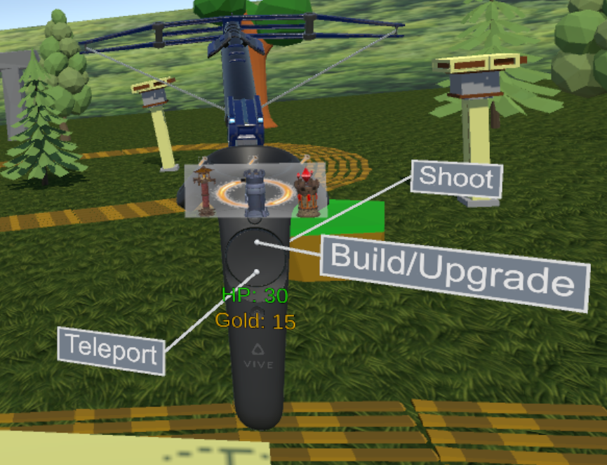

# 3DTowerDefenseVR (June 2019)
Master's thesis. Implemented a 3D Tower Defense in Unity for HTC Vive VR.

3D models downloaded from Unity Asset Store.

## Project Description

The game starts with the menu, which presents 3 sub-menus (one for difficulty, one for level selection and one for number of controllers as input). Upon choosing a level, the player will find himself standing on a tall pillar.

The rules are just as in a classic Tower Defense in the sense that the player must protect an objective and waves of enemies are heading for the objective. The player must build towers to stop the enemies.

In this game, the player must defend the gate (which has its own HP) and enemies are spawning from behind a stone gate and are marching towards the gate on the designed path. Player can build three types of towers, each with its own characteristics, but can also shoot with his crossbow. Towers can be built on towerbases (which are low-altitude platforms) and player can move around the map by teleporting around the tall pillars. Towers can be upgraded and cost gold to build and upgrade and killing enemies grants gold.

## Screenshots

Menu of the game, with its three sub-menus: difficulty selection, level selection and input selection

Button hints displayed at the start of the game

The latest iteration of the UI, showing the current gold, the current gate's HP, and the three towers which can be built. The hammer icon above each one means that the player has enough gold to build it. The currently selected tower is in the middle, encircled by the golden ring.

Player in action in Forest level, fighting against Wave 3.

Desert level

Player aiming at a tower-base to build the cannon tower. A ghost is shown in order to let the player know where and what type of tower he will build.

Nova tower in action, AOE effect, sending red novas damaging all nearby enemies.

